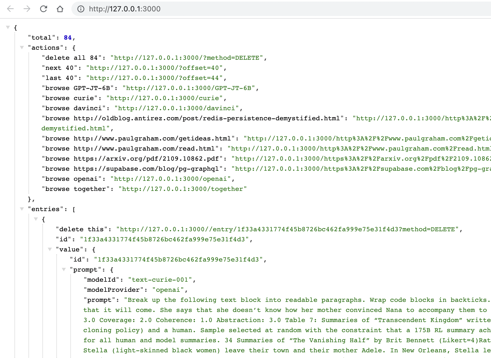
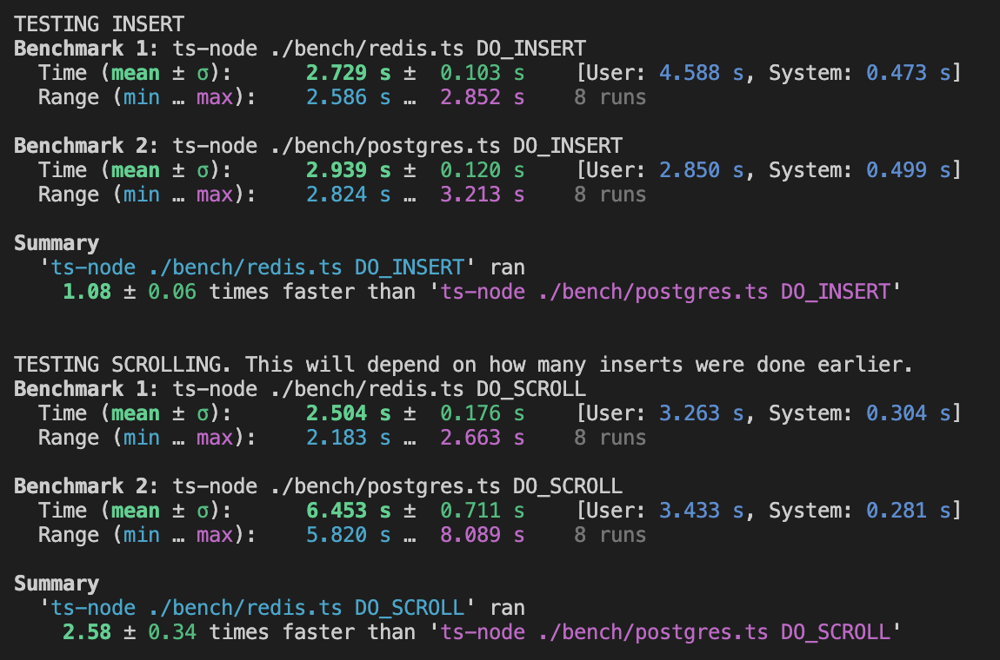
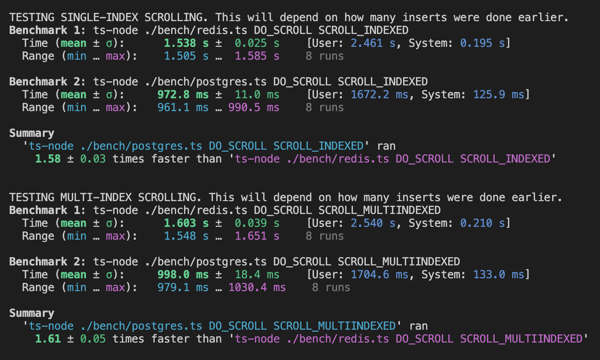
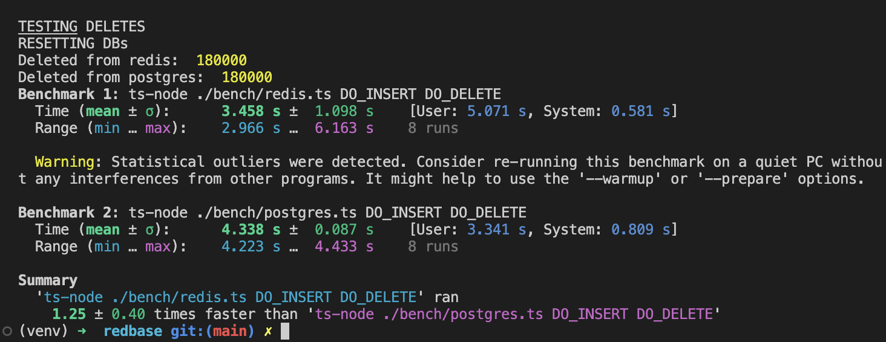

# Redbase

A simple, fast, indexed, and type-safe database on top of Redis.

Built to answer the question, "how can I have a queryable, browsable db that also works well as a cache?"

## Goals

- **Simple**: less than 500 lines, and no dependencies. You can copy-paste the code instead if you want.
- **Serverless-friendly**: no Redis modules, only core Redis. Multiple Redis clients supported, including REST-based ones.
- **Fast**: Compared to optimized Postgres, 150% faster at paginating unindexed data. See [all benchmarks](#benchmarks) below.
- **Indexable**: Supports hierarchical [tags](#tags), a lightweight primitive for indexing your data.
- **Browsable**: [browser-friendly API](#example-browsing-your-data) included for paginating and browsing by tag.

_Non-goals_

- No dependencies on Redis modules. Useful for deploying on platforms like [Upstash](https://upstash.com/).
- Never queries "KEYS" on your redis instance, which is expensive. Uses simple [set theory](https://github.com/alexanderatallah/redbase/blob/main/src/redbase.ts#L445) and data structures to implement query logic.

In a few lines:
```ts
import { Redbase } from 'redbase'
const db = new Redbase<MyDataType>('my-project')
const value = await db.get(id) // type: MyDataType
```

Exploration API:
`npm run server`

[![npm package][npm-img]][npm-url]
[![Downloads][downloads-img]][downloads-url]
[![Issues][issues-img]][issues-url]
[![Code Coverage][codecov-img]][codecov-url]
[![Commitizen Friendly][commitizen-img]][commitizen-url]
[![Semantic Release][semantic-release-img]][semantic-release-url]

- [Redbase](#redbase)
  - [Goals](#goals)
  - [Install](#install)
    - [Redis Client Compatibility](#redis-client-compatibility)
  - [Usage](#usage)
    - [One-to-Many Relationships](#one-to-many-relationships)
    - [Many-to-Many Relationships](#many-to-many-relationships)
  - [Core concepts](#core-concepts)
    - [Entries](#entries)
    - [Tags](#tags)
    - [Example: Prompt Cache](#example-prompt-cache)
    - [Example: Browsing Your Data](#example-browsing-your-data)
  - [Benchmarks](#benchmarks)
    - [For the cache use-case](#for-the-cache-use-case)
    - [For the database use-case](#for-the-database-use-case)
    - [Results](#results)
  - [Contributing](#contributing)
    - [Writing Adapters](#writing-adapters)
  - [License](#license)

## Install

```bash
npm install redbase
```

### Redis Client Compatibility

Redbase can support arbitrary Redis clients through the use of [custom adapters](#writing-adapters). The current clients supported are:

- [ioredis](https://github.com/luin/ioredis)
- [redis](https://github.com/redis/node-redis)

## Usage

```ts
import { Redbase } from 'redbase'

// Can use strings, numbers or buffers as well
type MyValue = {
  a: string
  b?: {
    c: string
  }
}

// Options can also use your own Redis instance if already defined,
// as `redis`
const db = new Redbase<MyValue>('myProject', { redisUrl: 'redis://...' })

const key = uuid()
const value = { a: 'result' }

await db.get(key) // undefined

await db.save(key, value)

await db.get(key) // value

// Type safety!
await db.save(key, { c: 'result2' }) // Type error on value

// Browsing results
let data = await db.filter()
assertEqual(data, [{ id: key, value }])
assertEqual(await db.count(), 1)

// Hierarchical indexes, using a customizable tag separator (default: '/')
await Promise.all([
  // Redis auto-pipelines these calls into one fast request!
  db.save(uuid(), { a: 'hi' }, { tags: ['user1/project1'] }),
  db.save(uuid(), { a: 'there' }, { tags: ['user1/project2'] }),
  db.save(uuid(), { a: 'bye' }, { tags: ['user2/project1'] })
])

data = await db.filter()
assertEqual(data.length, 4)

// WHERE queries, using tag names
data = await db.filter({ where: 'user1'})
assertEqual(data.length, 2)

// AND and OR queries:
data = await db.filter({ where: {OR: ['user1', 'user2']}})
assertEqual(data.length, 3)

const count = await db.count({ where: {AND: ['user1', 'user2']}})
assertEqual(count, 0)

// See all your indexes:
const tags = await db.tags("user1")
assertEqual(tags.length, 2)

// Clear just parts of the database:
const numberDeleted = await db.clear({ where: 'user2' })
assertEqual(numberDeleted, 1)
```

### One-to-Many Relationships

Let's say you have User and Post interfaces that look like this:
```ts
interface User {
  id: number
  name: string
}
interface Post {
  content: string
  userId: number
}
```

Now we want to store this data in Redbase. Rather than store all posts in an array inside of each `User` (which you might do in a NoSQL database), you can simply create separate Redbase clients for the two interfaces:

```ts
// Slightly more efficient to share the same redis instance:
import { IORedis } from 'redbase'
const redis = new IORedis()
const users = new Redbase<User>('myProject-user', { redis })
const posts = new Redbase<Post>('myProject-post', { redis })
```

When inserting a new Post for a given `userId`, make sure you tag it:

```ts
await posts.save(uuid(), post, { tags: [`user-${userId}`] })
```

Now we can query all posts for a given user:

```ts
const userPosts = await posts.filter({ where: `user-${userId}`, limit: 100 })
```

Note that tags are simple and don't have contraints; if the user's id changes, you have to re-save each of its posts with the new tag.

### Many-to-Many Relationships

Let's say you have Posts and Categories that look like this:

```ts
interface Post {
  id: number
}
interface Category {
  name: string
}
```

For many-to-many relationships, e.g. `Post` <-> `Category`, you can make the save atomic inside a Redis transaction by calling `multiSet` instead of `save`:

```ts
const redis = new IORedis()
const categories = new Redbase<Category>('myProject-category', { redis })
const posts = new Redbase<Post>('myProject-post', { redis })

const post = { id, ... }
const categoryNames = ['tech', 'draft', ...]

let multi = redis.multi()
multi = posts.multiSet(multi, post.postId, post, { tags: categoryNames })
for (const name of categoryNames) {
  multi = categories.multiSet(name, { name }, { tags: [`post-${post.id}`] })
}
await multi.exec()
```

For all functionality, see `test/database.spec.ts`.

## Core concepts

There are two main concepts in Redbase: entries and tags. This section explains them and then provides example code combining both.

### Entries

An entry is composed of an `id` and a `value`:
- Values are type-checked, but schemaless.
- IDs are strings. You are in charge of creating them, e.g. by hashing your value, making a UUID, using some external id, etc.
- If you have a non-string key that you want to use with your value (as is the case when you're storing prompts + completions), you can combine them into one value type. See [the prompt cache example](#example-prompt-cache) below.

### Tags

Tags are a lightweight primitive for indexing your values. You attach them at insert-time, and they are schemaless. This makes them simple and flexible for many use cases:

- Tags allow you to index values by external attributes (that aren't a part of the value itself: [example](#example-prompt-cache)).
- Tags allow you to link values between Redbase instances in [one-to-many relationships](#one-to-many-relationships), or even have [many-to-many relationships](#many-to-many-relationships) between data types. You can shard data between multiple Redis instances this way.
- Tags can be nested with a chosen separator, e.g. `parentindex/childindex`. This effectively allows you to group your indexes, and makes [browsing](#example-browsing-your-data) your data easier and more fun.

Calling `db.filter({ where: { AND: [...]}})` etc. allows you to intersect tags together, and doing the same with `OR` allows you to union them.

Call `db.tags(parentIndex)` to get all the children tags of `parentIndex`.

Tags are sort of self-cleaning: indexes delete themselves during bulk-delete operations, and they shrink when entries are deleted individually. However, when the last entry for an index is deleted, the index is not. This shouldn't cause a significant zombie index issue unless you're creating and wiping out an unbounded number of tags.

Tags can get unruly, so you can keep them organized by nesting them. As you might expect, when indexing an entry under `parentindex/childindex`, the entry is automatically indexed under `parentindex` as well. This makes it easy to build a url-based [cache exploration server](#example-browsing-your-data). Call `db.filter({ where: parentIndex })` to get all entries for all children tags under `parentIndex`.


### Example: Prompt Cache

Sample code for setting up the prompt cache for a large language model (LLM), like [OpenAI](https://platform.openai.com/docs/introduction):

```ts
import { CreateCompletionRequest, CreateCompletionResponse, OpenAIApi } from 'openai'

export const CACHE_NAME = 'promptCache'
const CACHE_EXPIRATION = 60 * 60 * 24 * 7 * 4 * 2 // 2 months

export type PromptQuery = CreateCompletionRequest
export type PromptResult = CreateCompletionResponse
export type PromptEntry = { prompt: PromptQuery, completion: PromptResult }
export const promptCache = new Redbase<PromptEntry>(CACHE_NAME, { defaultTTL: CACHE_EXPIRATION })
```

Now, you can cache and index your prompts by doing this:

```ts
// Tags can include metadata that isn't present in the value itself.
const tags = [
  `user-${user || ""}`,
  `url-${encodeURIComponent(url)}/leaf-${leafNumber}`
]
const payload = { ...requestData, user }
const response = await openai.createCompletion(payload)
await promptCache.save(id, {
  prompt: requestData,
  completion: response.data
}, { tags })
```

### Example: Browsing Your Data

To browse, paginate, filter, and delete your data directly from a browser, just fire up the API:

`npm run server`



## Benchmarks

**Note:** I'm very new to benchmarking open-sourced code, and would appreciate pull requests here! One issue, for example, is that increasing the number of runs can cause the data to scale up (depending on which benchmarks you're running), which seems to e.g. make Redis win on pagination by a larger margin.

These benchmarks use [hyperfine](https://github.com/sharkdp/hyperfine) and compare Redis in a persistent mode with Postgres in an optimized mode. Yes, this is still comparing apples to oranges in a sense, but I decided to do it anyway because:

1. A big question this project answers is "how can I have a queryable, browsable db that also works well as a cache?" Redis and Postgres are two backend choices that pop up frequently.

2. Not many people seem to know that Redis has an append-only file (AOF) persistence option. I heard about this and was curious to see how it performed.

3. I wanted to compare with an on-disk database solution to get a sense of where the advantage lies for using a persistent, in-memory database as a primary database.

All that said, the benchmarks put Redis and Postgres in [roughly equivalent persistence settings](http://oldblog.antirez.com/post/redis-persistence-demystified.html), which you can play with:

- Redis is set up using `SET appendfsync everysec`, which issues `fsync` calls between 0 and 2 seconds.

- Postgres is set up using `SET synchronous_commit=OFF`, which delays writing to WAL by 0.6 seconds.

These settings were chosen because they somewhat balance the speed needs of a cache with the durability needs of a database. To use one or the other:

### For the cache use-case
Comment-out the Redis config lines in `setupRedis` in `/bench/redis`. Similarly configure your project's Redis setup, of course, though it's the Redis default.

### For the database use-case
Comment-in the Redis config line `redis.config('SET', 'appendfsync', 'always')` in `/bench/redis.ts`. Similarly configure your project's Redis setup, of course.

Comment-out the call to `ALTER DATABASE ... SET synchronous_commit=OFF;` in `/bench/postgres.ts`. This reverts to the default (fully-persistent) Postgres setting.

### Results
- **Inserting data**: Tie
- **Paginating unindexed data**: Redbase is ~150% faster
- **Single-index pagination**: Postgres is ~50% faster
- **Joint-index pagination**: Postgres is ~60% faster
- **Inserting and deleting data**: Redbase is ~25% faster

Results on Apple M1 Max, 2021:




## Contributing

See open pull requests and issues on [Github](https://github.com/alexanderatallah/redbase).

### Writing Adapters

You can add support for new [Redis clients](#redis-client-compatibility) by writing an adapter. Adapters are located in `src/adapters/`. It's easy to duplicate one and adjust.

## License
MIT

[build-img]: https://github.com/alexanderatallah/redbase/actions/workflows/release.yml/badge.svg
[build-url]: https://github.com/alexanderatallah/redbase/actions/workflows/release.yml
[downloads-img]: https://img.shields.io/npm/dt/redbase
[downloads-url]: https://www.npmtrends.com/redbase
[npm-img]: https://img.shields.io/npm/v/redbase
[npm-url]: https://www.npmjs.com/package/redbase
[issues-img]: https://img.shields.io/github/issues/alexanderatallah/redbase
[issues-url]: https://github.com/alexanderatallah/redbase/issues
[codecov-img]: https://codecov.io/gh/alexanderatallah/redbase/branch/main/graph/badge.svg
[codecov-url]: https://codecov.io/gh/alexanderatallah/redbase
[semantic-release-img]: https://img.shields.io/badge/%20%20%F0%9F%93%A6%F0%9F%9A%80-semantic--release-e10079.svg
[semantic-release-url]: https://github.com/semantic-release/semantic-release
[commitizen-img]: https://img.shields.io/badge/commitizen-friendly-brightgreen.svg
[commitizen-url]: http://commitizen.github.io/cz-cli/
